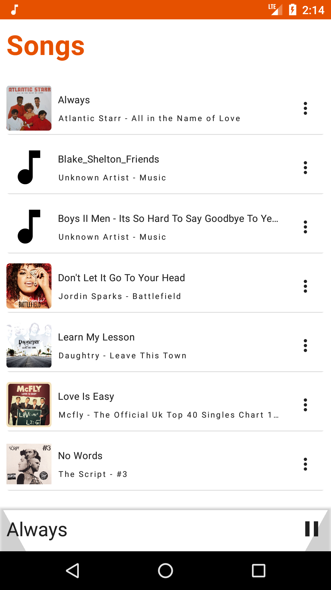

# Muziki
Muziki(Music in Kiswahili) is a simple music player for playing local music on your device. The app is entirely written in kotlin and Jetpack Compose for the UI.
The app is still a work in progress :construction: :hammer_and_wrench:

Libraries used include:
- Architecture components(LiveData, ViewModel)
- Jetpack Compose
- Hilt
- Exoplayer

You can play songs and browse songs by album and artist.

## Screenshots
 &nbsp;  &nbsp;  &nbsp;  &nbsp; 

