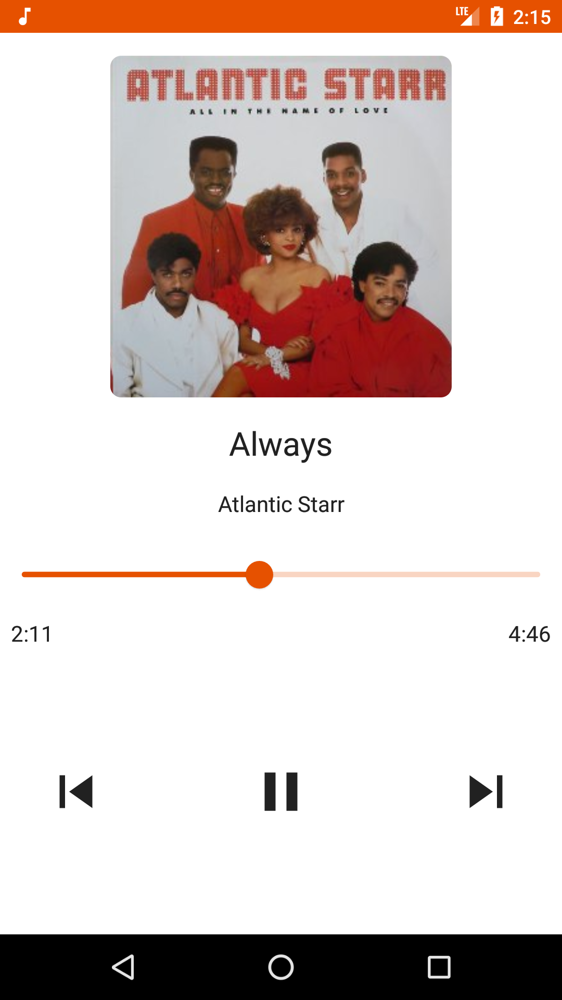

# Muziki
Muziki(Music in Kiswahili) is a simple music player for playing local music on your device. The app is entirely written in kotlin and Jetpack Compose for the UI.
The app is still a work in progress :construction: :hammer_and_wrench:

Libraries used include:
- Architecture components(LiveData, ViewModel, Room)
- Jetpack Compose
- Hilt
- Exoplayer

Features:
- Play songs
- Browse songs by album and artist
- Create playlists

## ToDo
- Fix bugs

## Screenshots
### Light
 &nbsp;  &nbsp;  &nbsp;  &nbsp;  &nbsp; 

### Dark
 &nbsp; 
